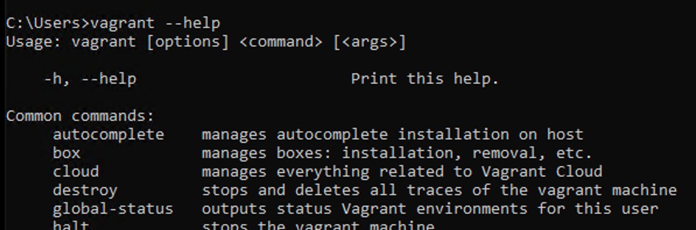
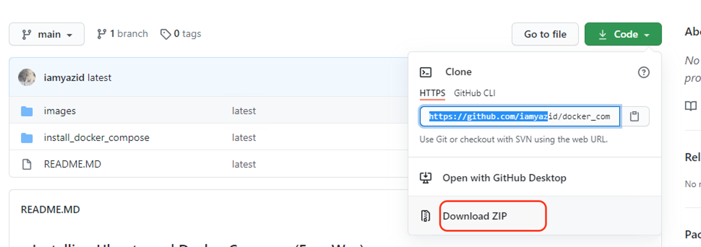
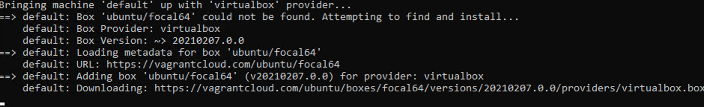
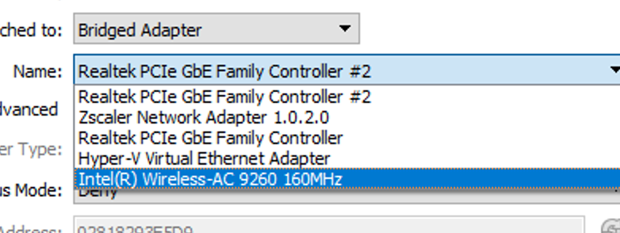

### Installing Ubuntu and Docker Compose (Easy Way)

- Do This on ***Windows*** Computer
- Disable Hyper-V on your windows machine

```console
Disable-WindowsOptionalFeature -Online -FeatureName Microsoft-Hyper-V-All
```

- Download & Install ***Virtualbox*** at https://www.virtualbox.org/wiki/Downloads


- Download & Install ***Vagrant*** at https://www.vagrantup.com/downloads


- Restart Computer

- Open Terminal and run

```console
vagrant --help
```


if result not empty, vagrant is successfully installed

- Download this repository, extract and move to desktop.



- change directory to your install_docker_compose_location

```console
cd .../docker_compose/install_docker_compose
```

- Spin the virtual machine

```console
vagrant up
```


- ssh to virtual machine

```console
vagrant ssh
```

- Elevated to root. Password: vagrant

```console
su root
```

- Check docker status

```console
docker ps
```
- Check compose status

```console
docker-compose --version
```

- change VM network to bridge and reboot the server.
  
- Find ip address and later you can ssh through putty or winscp

- To destroy VM. exit the VM, then type:

```console
vagrant destroy
```
