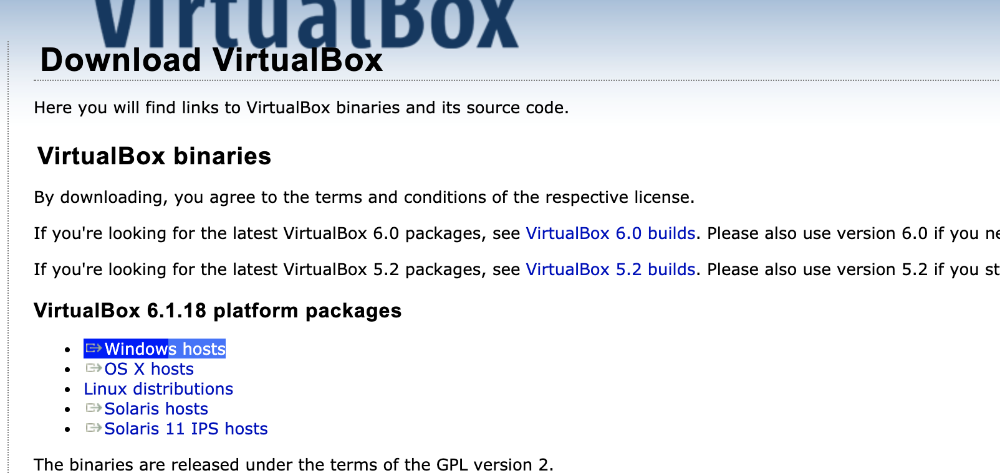
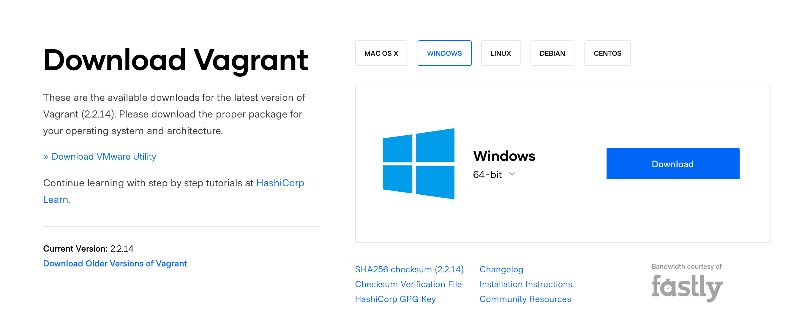

### Installing Ubuntu and Docker Compose (Easy Way)

- Do This on Windows Computer
- Disable Hyper-V on your windows machine

```console
Disable-WindowsOptionalFeature -Online -FeatureName Microsoft-Hyper-V-All
```

- Download & Install Virtualbox at https://www.virtualbox.org/wiki/Downloads


- Download & Install Vagrant at https://www.vagrantup.com/downloads


- Restart Computer
